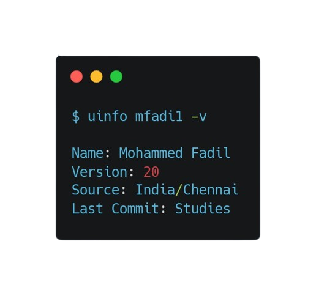

  
&nbsp;&nbsp;

  

  

  

### LANGUAGES & TOOLS >>>>

### ACTIVITY >>>>
<!--START_SECTION:activity-->
1. ❗ Opened issue [#15](https://github.com/Jisin0/filmigobot/issues/15) in [Jisin0/filmigobot](https://github.com/Jisin0/filmigobot)
2. 🎉 Merged PR [#14](https://github.com/Jisin0/filmigobot/pull/14) in [Jisin0/filmigobot](https://github.com/Jisin0/filmigobot)
3. 💪 Opened PR [#14](https://github.com/Jisin0/filmigobot/pull/14) in [Jisin0/filmigobot](https://github.com/Jisin0/filmigobot)
4. 🎉 Merged PR [#9](https://github.com/Jisin0/filmigobot/pull/9) in [Jisin0/filmigobot](https://github.com/Jisin0/filmigobot)
5. 🎉 Merged PR [#8](https://github.com/Jisin0/filmigobot/pull/8) in [Jisin0/filmigobot](https://github.com/Jisin0/filmigobot)
<!--END_SECTION:activity-->

